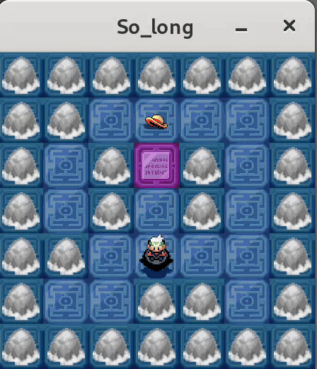

	
	<h1 align="center"> ~SO_LONG~  </h1>

A simple 2D game using the MLX42 library. 

<code>So_Long</code> is a project from the <b>Common Core</b> of <b>42Cursus</b> where you will learn about basic game development and graphical programming using the MLX42 library in C. The objective is to create a small game where the player can move around a map, collect items, and reach an exit.

  

## Description

The So_Long program consists of a simple 2D game where the player navigates through a map, collects coins, and reaches the exit to win. The game is built using the MLX42 library for graphical rendering.

## Using the So_Long Program

### 1. Compile the Program

To compile the program, use the provided Makefile by typing `make` in the terminal.

    make

### 2. Run the Game

To run the game, provide the path to a map file as an argument. The map file should have a `.ber` extension and follow the required format.

    ./So_Long maps/map.ber

### Game Mechanics

1. **Player Movement**:
   - Use the W, A, S, D keys to move the player up, left, down, and right, respectively.
   - The player can move on empty spaces and collect coins.

2. **Collecting Coins**:
   - The player must collect all coins on the map before reaching the exit.

3. **Reaching the Exit**:
   - Once all coins are collected, the player can move to the exit to win the game.

## Core Concepts

### Map Parsing

Parsing the map correctly is crucial for the game's functionality. The map must be validated to ensure it meets the required format and constraints. This includes checking for rectangular shape, surrounding walls, and the presence of necessary elements like the player, exit, and coins.

### Understanding Libraries

Understanding how to use external libraries, such as MLX42, is essential for developing your own projects. MLX42 provides the tools needed for graphical rendering, and learning to integrate and utilize these tools effectively is a key part of the project.

## Functions and Files

### Main Functions

- **main.c**:
  - `main`: Initializes the game, processes the map, and starts the game loop.

- **mlx_init.c**:
  - `process_images`: Initializes the MLX42 library, loads textures and images, and renders the map.

- **mlx_keyhook.c**:
  - `ft_key_hook`: Handles key press events for player movement and game exit.

- **check_elements.c**:
  - `check_elements`: Validates the map elements and ensures the map is surrounded by walls.

- **check_path.c**:
  - `check_path`: Checks if there is a valid path for the player to collect all coins and reach the exit.

- **parse_input.c**:
  - `init_values`: Initializes game values and structures.
  - `check_extension`: Validates the map file extension.

- **get_map.c**:
  - `get_map`: Reads and processes the map file.

- **utils_mlx.c**:
  - `finish_game`: Ends the game when the player reaches the exit with all coins collected.
  - `set_keyimage`: Sets the appropriate image for each map element.

- **utils_map.c**:
  - `ft_error`: Prints an error message and exits the program.

- **utils_free.c**:
  - `ft_freegame`: Frees all allocated memory and resources used by the game.

## Map File Format

The map file should have a `.ber` extension and follow these rules:
- The map must be rectangular.
- The map must be surrounded by walls ('1').
- The map must contain at least one player ('P'), one exit ('E'), and one coin ('C').

Example map file (`map.ber`):

	111111
	1P0C01
	100001
	1C0E01
	111111

For compilation, you can use the Makefile by typing `make` followed by the desired rule command.

## Functions

Original Functions|Description
----------------:|:----------
[`main`](https://github.com/eduaserr/So_Long/blob/main/main.c)|Initializes the game, processes the map, and starts the game loop.
[`process_images`](https://github.com/eduaserr/So_Long/tree/main/src/mlx/mlx_init.c)|Initializes the MLX42 library, loads textures and images, and renders the map.
[`ft_key_hook`](https://github.com/eduaserr/So_Long/tree/main/src/mlx/mlx_keyhook.c)|Handles key press events for player movement and game exit.
[`check_elements`](https://github.com/eduaserr/So_Long/tree/main/src/parse/get_map.c)|Validates the map elements and ensures the map is surrounded by walls.
[`check_path`](https://github.com/eduaserr/So_Long/tree/main/src/init/check_path.c)|Checks if there is a valid path for the player to collect all coins and reach the exit.
[`init_values`](https://github.com/eduaserr/So_Long/tree/main/src/parse/get_map.c)|Initializes game values and structures.
[`check_extension`](https://github.com/eduaserr/So_Long/tree/main/src/parse/parse_input.c)|Validates the map file extension.
[`get_map`](https://github.com/eduaserr/So_Long/tree/main/src/parse/get_map.c)|Reads and processes the map file.
[`finish_game`](https://github.com/eduaserr/So_Long/tree/main/src/utils/utils_mlx.c)|Ends the game when the player reaches the exit with all coins collected.
[`set_keyimage`](https://github.com/eduaserr/So_Long/tree/main/src/utils/utils_mlx.c)|Sets the appropriate image for each map element.
[`ft_error`](https://github.com/eduaserr/So_Long/tree/main/src/utils/utils_map.c)|Prints an error message and exits the program.
[`ft_printmap`](https://github.com/eduaserr/So_Long/tree/main/src/utils/utils_map.c)|Prints the map to the console.
[`ft_freegame`](https://github.com/eduaserr/So_Long/tree/main/src/utils/utils_free.c)|Frees all allocated memory and resources used by the game.

---
*Proyecto desarrollado como parte del curriculum de 42.*